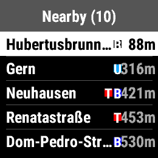
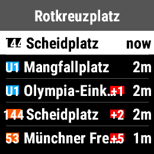

# Munich Public Transport for Garmin Watches

A [Garmin Connect IQ](https://developer.garmin.com/connect-iq/overview/) widget that puts Munich public transport (MVG) departures on your wrist. Find nearby stations via GPS, check real-time departures with delay and cancellation info, and save your favorite stops for quick access.

## Features

- **Glance View** — See the next departure from your most recently viewed station right in the widget loop, no tap required.
- **Nearby Stations** — Uses your watch GPS to find the closest MVG stops.
- **Favorites** — Save stations you use often.
- **Live Departures** — View upcoming departures for any station: line number, destination, departure time, and delay.

<table>
  <tr>
    <td align="center"> Nearby Stations</td>
    <td align="center"> Live Departures</td>
  </tr>
</table>

## Requirements

- **Device:** Garmin compatible — adjust `iq:products` in `manifest.xml`)
- **API Level:** 5.2.0+
- **SDK:** [Connect IQ SDK](https://developer.garmin.com/connect-iq/sdk/) 5.2+
- **Permissions:**
  - `Positioning` — GPS location for nearby search
  - `Communications` — Bluetooth/web requests to the MVG API
  - `PersistedContent` — Save favorites on the watch

## Acknowledgements

This widget uses the public MVG API. **This app is not affiliated with, endorsed by, or connected to Münchner Verkehrsgesellschaft (MVG) in any way.** The MVG API is provided by MVG and all data belongs to them.

## Disclaimer

This software is provided "as is", without warranty of any kind. Use at your own risk. The authors are not responsible for the accuracy of departure data or any consequences arising from its use.

## License

[MIT](LICENSE)
